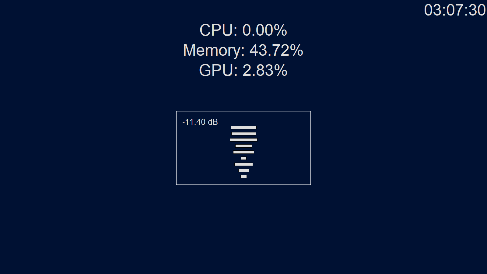

<h1 style="text-align: center;">Monitor 🖥️</h1>

<h2 style="text-align: center;">
Algo para deixar na segunda tela, com informações de use de CPU, RAM, e GPU, um relógio, e um visualizador de áudio.
</h2>

